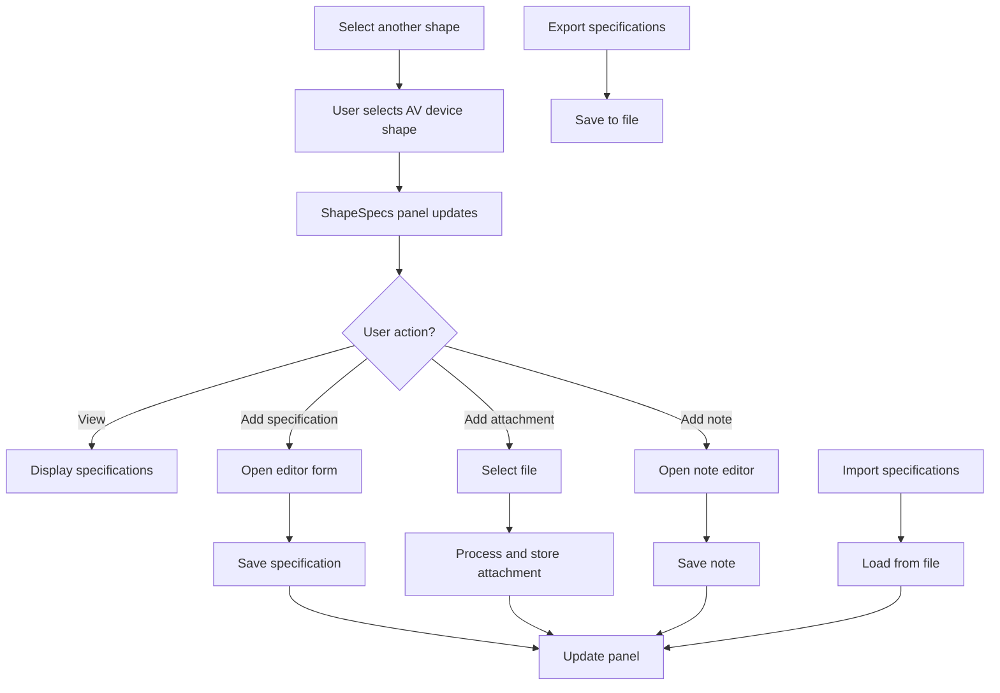
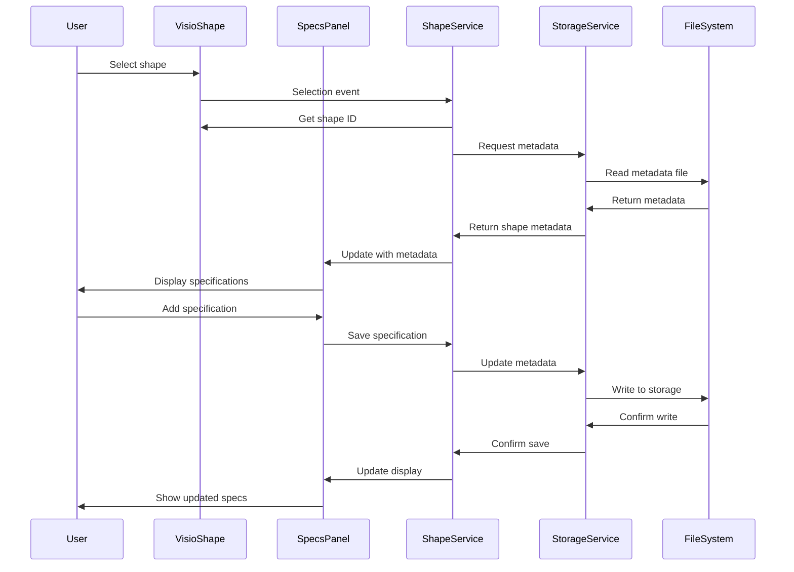

# ShapeSpecs Visio Add-in

ShapeSpecs is a Microsoft Visio add-in designed to enhance AV engineering workflows by attaching technical specifications and other documentation to AV device shapes in Visio diagrams.

## Project Overview

This project implements a VSTO-based add-in for Microsoft Visio that allows users to:

- Attach text specifications to shapes
- Add images and documents as attachments
- Add notes and comments to shapes
- Import and export specifications
- Centralize critical shape information (device specs, AV notes, installation guidelines)

## Workflow Diagrams

### User Workflow



### Data Flow



## Repository Structure

The solution is organized into three main projects:

- **ShapeSpecs.Core**: Core business logic, models, and services
- **ShapeSpecs.UI**: User interface components and controls
- **ShapeSpecs.Addin**: VSTO add-in integration with Visio

## Development Setup

### Prerequisites

- Visual Studio 2019 or newer with:
  - .NET Desktop Development workload
  - Office/SharePoint Development workload
- Microsoft Visio 2016 or newer (32-bit or 64-bit)
- .NET Framework 4.7.2 or newer

### Getting Started

1. Clone this repository
2. Open `ShapeSpecs.sln` in Visual Studio
3. Restore NuGet packages
4. Build the solution
5. Start debugging (F5) to launch Visio with the add-in loaded

### Required NuGet Packages

The following NuGet packages should be added to the appropriate projects:

```
Install-Package Newtonsoft.Json -ProjectName ShapeSpecs.Core
Install-Package System.Drawing.Common -ProjectName ShapeSpecs.Core
```

## Implementation Status

### ✅ Phase 1: Core Foundation (Completed)

- ✅ Basic dockable panel UI with tabbed interface
- ✅ Shape selection handling and event management
- ✅ Text specification storage and retrieval
- ✅ Initial ribbon integration
- ✅ Build system and project files (.csproj, NuGet packages)
- ✅ Unit test infrastructure with 32+ tests
- ✅ IDisposable pattern for resource management
- ✅ Async file operations support

### ✅ Phase 2: File Management (Completed)

- ✅ External storage system with organized directory structure
- ✅ File attachment capabilities (add, view, delete)
- ✅ Import/export functionality for specifications
- ✅ File preview via default application integration
- ✅ Support for images, PDFs, documents, and other file types
- ✅ Automatic thumbnail generation for images
- ✅ JSON-based import/export with merge support

### 🔄 Phase 3: Advanced Features (Next)

- Rich text editing
- Multi-shape specification handling
- Note management (add, edit, delete notes)
- Template system for common device types
- Specification versioning and history

### 📦 Phase 4: Finalization

- UI/UX refinement
- Performance optimization
- Enhanced error handling
- Deployment package creation

## Features

### File Attachments
- **Add files** via ribbon button or panel
- **View attachments** with default application
- **Delete attachments** with confirmation dialog
- **Organize by type**: Images, PDFs, Documents, Others
- **Thumbnails**: Automatically generated for images
- **File info**: Display size, type, and date added

### Import/Export
- **Export to JSON**: Save shape specifications to portable JSON files
- **Import from JSON**: Load specifications with intelligent merging
- **Preserve data**: Text specifications, notes, and metadata
- **Timestamped exports**: Automatic filename with date/time
- **Merge strategy**: Overwrites existing specs, appends notes

### Storage System
- **External storage**: Files stored outside Visio document
- **Organized structure**: Shapes/{ShapeId}/{Type}/files
- **Relative paths**: Portable storage references
- **JSON metadata**: Human-readable specification format
- **Automatic cleanup**: Resource disposal patterns

## Architecture Documentation

For detailed architecture information, see the following documents:

- [ShapeSpecs_Architecture.md](ShapeSpecs_Architecture.md) - Detailed architectural design
- [ShapeSpecs_Implementation_Guide.md](ShapeSpecs_Implementation_Guide.md) - Implementation strategy
- [CONTRIBUTING.md](CONTRIBUTING.md) - Development guidelines and coding standards

## Known Limitations

- **Shape ID persistence**: Based on document name, so renaming documents breaks the association with metadata (documented limitation for Phase 1)
- **Note management**: Add/edit/delete functionality is placeholder for Phase 3
- **Settings UI**: Configuration interface planned for Phase 3
- **Templates**: Template system for common device types planned for Phase 3
- **Versioning**: Specification history tracking planned for Phase 3

## Next Steps

Phase 3 development will focus on:
1. Rich text editing for specifications and notes
2. Complete note management (add, edit, delete with priority/category)
3. Multi-shape specification handling
4. Template system for common AV device types
5. Specification versioning and change history
6. Settings/configuration UI

## License

This project is licensed under the MIT License - see the LICENSE file for details.