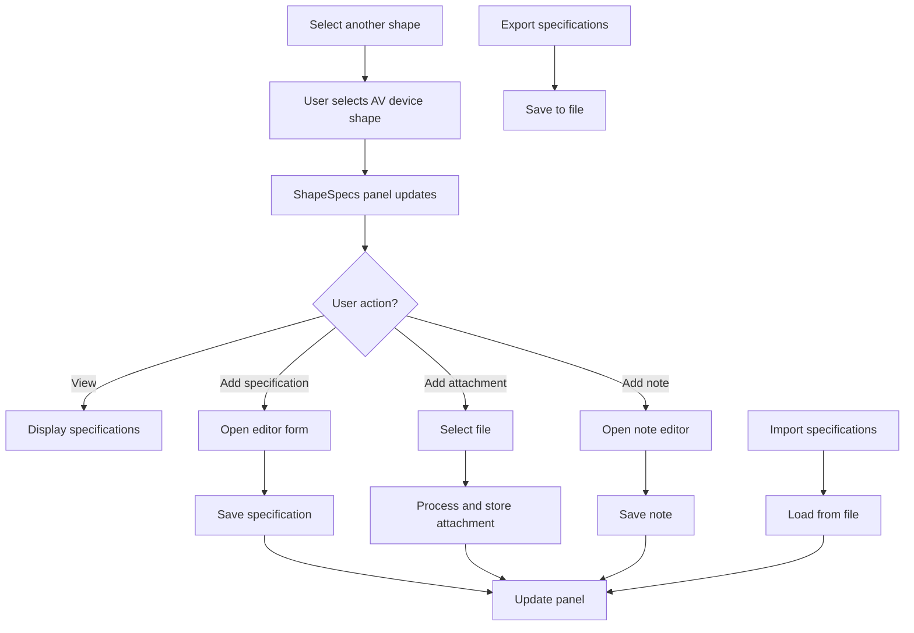
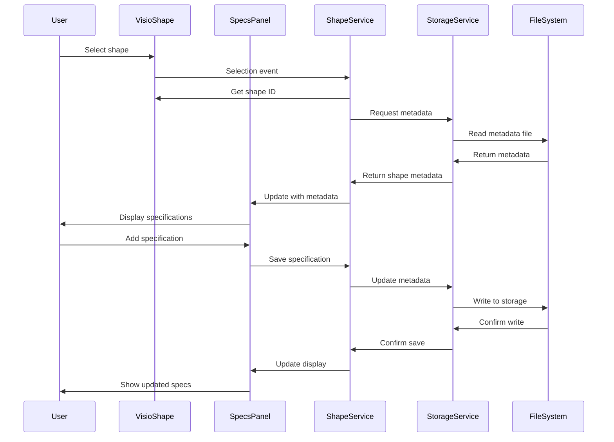

# ShapeSpecs Visio Add-in

**Have you ever spent hours hunting through PDF spec sheets to find the right cable type, mounting depth, or power draw for the AV device you just placed in a Visio diagram?** ShapeSpecs solves that by letting you attach technical specifications, notes, and file attachments directly to your AV device shapes — so the info lives with the diagram.

Built for AV systems engineers who use Visio as their primary design tool, ShapeSpecs adds a dockable panel that surfaces device specs the moment you select a shape. No more context-switching between your Visio drawing and a folder of product datasheets.

## Project Overview

This project implements a VSTO-based add-in for Microsoft Visio that allows users to:

- Attach text specifications to shapes
- Add images and documents as attachments
- Add notes and comments to shapes
- Import and export specifications
- Centralize critical shape information (device specs, AV notes, installation guidelines)

## Workflow Diagrams

### User Workflow



### Data Flow



## Repository Structure

The solution is organized into three main projects:

- **ShapeSpecs.Core**: Core business logic, models, and services
- **ShapeSpecs.UI**: User interface components and controls
- **ShapeSpecs.Addin**: VSTO add-in integration with Visio

## Development Setup

### Prerequisites

- Visual Studio 2019 or newer with:
  - .NET Desktop Development workload
  - Office/SharePoint Development workload
- Microsoft Visio 2016 or newer (32-bit or 64-bit)
- .NET Framework 4.7.2 or newer

### Getting Started

1. Clone this repository
2. Open `ShapeSpecs.sln` in Visual Studio
3. Restore NuGet packages
4. Build the solution
5. Start debugging (F5) to launch Visio with the add-in loaded

### Required NuGet Packages

The following NuGet packages should be added to the appropriate projects:

```
Install-Package Newtonsoft.Json -ProjectName ShapeSpecs.Core
Install-Package System.Drawing.Common -ProjectName ShapeSpecs.Core
```

## Implementation Plan

The project is being implemented in four phases:

### Phase 1: Core Foundation (Current)

- Basic dockable panel UI
- Shape selection handling
- Text specification storage and retrieval
- Initial ribbon integration

### Phase 2: File Management (Next)

- External storage system
- File attachment capabilities
- Import/export functionality
- File preview capabilities

### Phase 3: Advanced Features

- Rich text editing
- Multi-shape specification handling
- Template system
- Specification versioning

### Phase 4: Finalization

- UI/UX refinement
- Performance optimization
- Error handling improvements
- Deployment package

## Architecture Documentation

For detailed architecture information, see the following documents:

- [ShapeSpecs_Architecture.md](ShapeSpecs_Architecture.md) - Detailed architectural design
- [ShapeSpecs_Implementation_Guide.md](ShapeSpecs_Implementation_Guide.md) - Implementation strategy

## Known Limitations

- The current implementation focuses on Phase 1 features
- Some UI components have placeholder implementations that will be completed in future phases
- The dockable panel is implemented but not fully integrated with Visio's docking system

## Next Steps

To continue development:

1. Complete the remaining Phase 1 functionality:
   - Implement any missing UI components
   - Add more error handling
   - Create project files for each project

2. Begin implementing Phase 2 features:
   - Develop the file attachment system
   - Implement import/export functionality
   - Create file preview capabilities

3. Add unit tests to ensure stability

## License

This project is licensed under the MIT License - see the LICENSE file for details.