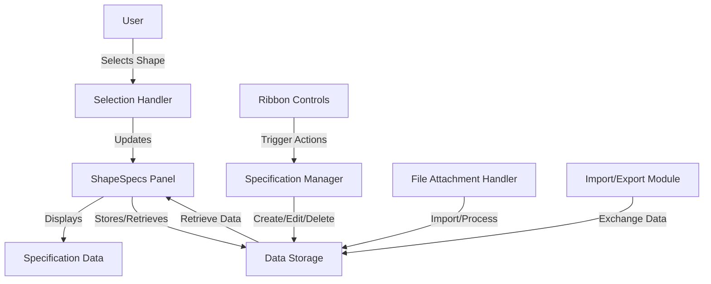
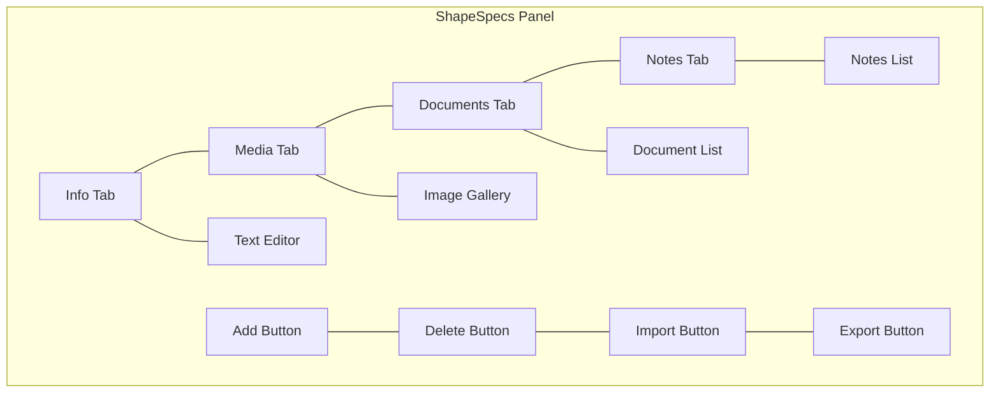
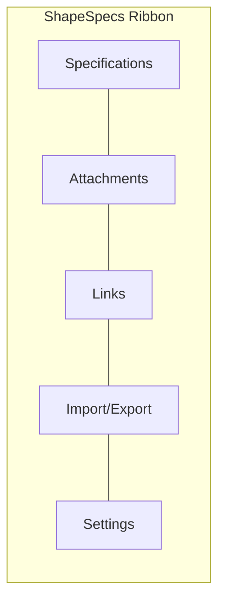
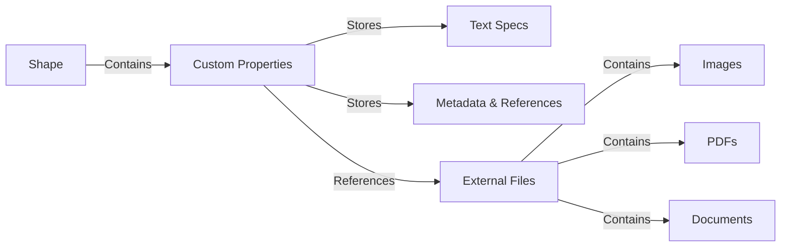
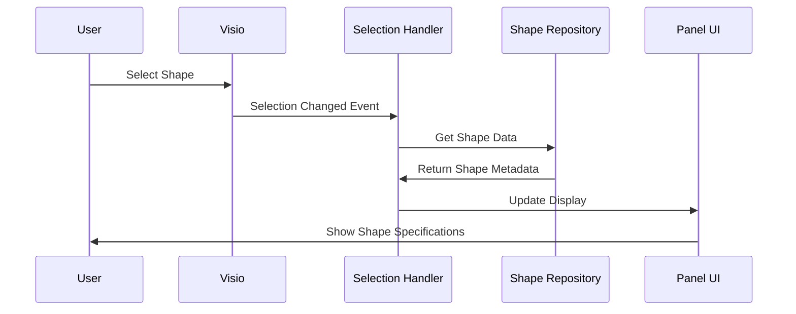

# ShapeSpecs: Architectural Design Document

## Executive Summary

ShapeSpecs is a Visio add-in designed to enhance AV engineering workflows by enabling users to attach technical specifications and other documentation to AV device shapes in Visio diagrams. This document outlines the architectural design, including component structure, data management strategy, implementation approach, and development roadmap.

## 1. Technical Approach

After analyzing the requirements, we recommend using **VSTO (C# .NET)** for development because:

- **Better integration with Visio desktop**: VSTO provides deep integration with Visio's object model
- **Strong support for handling various attachment types**: Text, images, PDFs, and other file types
- **Superior performance with larger files**: Can efficiently manage files up to 10MB per shape
- **Mature ecosystem**: Rich libraries and components for complex desktop add-ins
- **Reliable deployment**: Standard Office add-in deployment methods
- **Future-proofing**: Potential to extend to online scenarios in the future

## 2. System Architecture Overview



The architecture follows a modular approach with clear separation of concerns:

- **UI Layer**: Dockable panel and ribbon controls
- **Business Logic Layer**: Specification management, file handling, import/export
- **Data Layer**: Storage mechanisms for shape metadata and attachments

## 3. Core Components

### 3.1 User Interface Components

#### 3.1.1 ShapeSpecs Dockable Panel

The primary user interface will be a dockable panel within Visio that provides access to all ShapeSpecs functionality.

**Features:**
- Dynamically updates when shapes are selected
- Multi-tab interface:
  - **Info Tab**: Text specifications and general information
  - **Media Tab**: Images and visual specifications
  - **Documents Tab**: PDFs and external document links
  - **Notes Tab**: User-added annotations and comments

**UI Mock-up:**



#### 3.1.2 Custom Ribbon Tab

A dedicated ribbon tab will provide quick access to key ShapeSpecs functionality.

**Ribbon Components:**
- **Specifications**: Add/Edit/Delete specifications for selected shapes
- **Attachments**: Add/Remove/View attached files
- **Links**: Manage links to external resources
- **Import/Export**: Transfer specifications between shapes or files
- **Settings**: Configure application preferences

**Ribbon Design:**



### 3.2 Data Management

#### 3.2.1 Data Storage Strategy

We recommend a **hybrid approach** that balances performance, reliability, and file size constraints:

- **Shape Custom Properties**: Store small text data and metadata directly in shapes
- **External Storage**: Store larger binary data (images, PDFs) in a linked folder structure
- **Data Index**: Maintain relationships between shapes and their external assets



**Benefits of this approach:**
- Visio files remain smaller and more performant
- Shapes retain essential information even if external files are unavailable
- Large files (up to 10MB) can be managed without compromising Visio performance
- External files can be backed up or shared independently

#### 3.2.2 File Handling

The ShapeSpecs add-in will support a variety of file types and provide efficient mechanisms for importing, displaying, and managing them.

**Supported File Types:**
- Images: PNG, JPG, JPEG, GIF, BMP, TIFF, SVG
- Documents: PDF, DOCX, XLSX, PPTX, TXT, RTF, HTML
- Links: URLs to web resources, network paths

**File Management Features:**
- File preview capabilities within the panel
- Efficient compression for stored assets
- Thumbnail generation for quick browsing
- File versioning (optional for future enhancement)

### 3.3 Functional Modules

#### 3.3.1 Shape Selection Handler

This core module enables ShapeSpecs to respond to user interactions with shapes in the Visio diagram.

**Capabilities:**
- Real-time detection of shape selection events
- Efficient querying of shape properties
- Support for multi-shape selection
- Caching mechanisms to improve performance

**Event Flow:**



#### 3.3.2 Specification Manager

The Specification Manager handles all operations related to creating, viewing, updating, and deleting specifications associated with shapes.

**Core Functions:**
- Create, read, update, delete (CRUD) operations for specifications
- Rich text editing capabilities
- Template system for common specification types
- Search and filter functionality

#### 3.3.3 Document/Image Handler

This module manages all aspects of working with files attached to shapes.

**Features:**
- Import and process various file types
- Generate thumbnails and previews
- Handle file storage and retrieval
- Optional compression for efficiency

#### 3.3.4 Import/Export Module

Facilitates the transfer of specifications between shapes, documents, and external formats.

**Capabilities:**
- Batch import/export of specifications
- Template-based specification application
- Data migration between documents
- Export to standard formats (CSV, XML, JSON)

## 4. Data Structure

### 4.1 Shape Metadata Schema

Each shape will have associated metadata structured as follows:

```json
{
  "shapeId": "unique-identifier",
  "deviceType": "av-device-category",
  "model": "device-model-information",
  "textSpecifications": {
    "technical": "Technical specifications text...",
    "installation": "Installation notes...",
    "configuration": "Configuration details..."
  },
  "attachments": [
    {
      "id": "attachment-unique-id",
      "type": "image|pdf|document|link",
      "name": "Filename or description",
      "path": "Relative path or URL",
      "size": "File size in bytes",
      "dateAdded": "ISO date string"
    }
  ],
  "notes": [
    {
      "id": "note-unique-id",
      "text": "Note content...",
      "author": "Note creator",
      "dateAdded": "ISO date string"
    }
  ]
}
```

### 4.2 External Storage Structure

Files associated with shapes will be stored in a structured folder hierarchy:

```
[Visio Document Name]_assets/
├── [ShapeID1]/
│   ├── images/
│   │   └── [attachment-id].png
│   ├── documents/
│   │   └── [attachment-id].pdf
│   └── index.json
├── [ShapeID2]/
│   ├── images/
│   │   └── [attachment-id].jpg
│   ├── documents/
│   │   └── [attachment-id].docx
│   └── index.json
└── manifest.json
```

The `manifest.json` file will serve as a master index, tracking all shape-to-attachment relationships and enabling quick lookups.

## 5. Implementation Strategy

### 5.1 Development Phases

We recommend a phased approach to development to deliver value quickly while building toward the complete vision.

#### Phase 1: Core Foundation (2-3 weeks)
- Setup VSTO project structure
- Implement basic dockable panel UI
- Create shape selection handler
- Develop basic text specification storage/retrieval

**Deliverable:** Basic add-in that can store and display text specifications for shapes

#### Phase 2: File Management (3-4 weeks)
- Implement external storage system
- Develop file attachment capabilities
- Add import/export functionality
- Create file preview capabilities

**Deliverable:** Add-in that can attach various file types to shapes and manage them

#### Phase 3: Advanced Features (2-3 weeks)
- Implement rich text editing
- Add multi-shape specification handling
- Develop template system
- Create specification versioning

**Deliverable:** Enhanced add-in with advanced editing and management features

#### Phase 4: Finalization (1-2 weeks)
- Refine UI/UX
- Performance optimization
- Error handling and recovery
- Documentation and deployment package

**Deliverable:** Production-ready ShapeSpecs add-in with complete documentation

### 5.2 Technical Dependencies

- **.NET Framework 4.7.2+**: For VSTO development
- **Visual Studio 2019+**: Development environment
- **Microsoft Office 16.0 Object Library**: Visio integration
- **Windows Forms/WPF**: UI components
- **SQLite (optional)**: Local data indexing
- **DocumentFormat.OpenXml**: For document handling
- **System.IO.Compression**: For efficient storage
- **Newtonsoft.Json**: For JSON serialization/deserialization

### 5.3 Project Structure

```
ShapeSpecs/
├── ShapeSpecs.Core/
│   ├── Models/
│   │   ├── ShapeMetadata.cs
│   │   ├── Attachment.cs
│   │   └── Note.cs
│   ├── Services/
│   │   ├── ShapeService.cs
│   │   ├── FileService.cs
│   │   └── StorageService.cs
│   └── Utilities/
│       ├── JsonHelper.cs
│       └── FileHelper.cs
├── ShapeSpecs.UI/
│   ├── Forms/
│   │   ├── SpecsPanel.cs
│   │   ├── EditorForm.cs
│   │   └── SettingsForm.cs
│   ├── Controls/
│   │   ├── RichTextEditor.cs
│   │   └── FilePreview.cs
│   └── Ribbon/
│       └── ShapeSpecsRibbon.cs
└── ShapeSpecs.Addin/
    ├── ThisAddIn.cs
    ├── ShapeSelectionHandler.cs
    └── Resources/
        └── Icons/
```

## 6. Deployment Strategy

### 6.1 Installation Package
- ClickOnce deployment for easy installation and updates
- MSI installer option for enterprise deployment
- Silent installation support for automated deployment

### 6.2 Prerequisites
- .NET Framework 4.7.2+
- Visio 2016+ (32-bit or 64-bit)
- Windows 10/11

### 6.3 Update Mechanism
- ClickOnce automatic updates
- Version checking on startup
- Update notifications

### 6.4 Deployment Process
1. Build the solution in Release mode
2. Sign the assembly with a code signing certificate
3. Create the ClickOnce package
4. Publish to a deployment server
5. Distribute installation URL or MSI package

## 7. Testing Strategy

### 7.1 Test Environment
- Multiple Visio versions (2016, 2019, 365)
- Both 32-bit and 64-bit Office installations
- Various Windows versions (10, 11)

### 7.2 Test Categories

#### 7.2.1 Unit Testing
- Core functionality
- Data serialization/deserialization
- File operations

#### 7.2.2 Integration Testing
- Visio integration
- UI component interactions
- Data flow between modules

#### 7.2.3 Performance Testing
- Large document handling
- Multiple attachments
- Shape selection responsiveness

#### 7.2.4 User Acceptance Testing
- Typical AV engineering workflows
- File attachment workflows
- Import/export operations

### 7.3 Test Scenarios
- Performance with large attachments
- Multiple document handling
- Error recovery scenarios
- Shape metadata persistence
- Import/export functionality

## 8. Future Expansion Considerations

While not immediately required, the architecture is designed to support future expansion in several areas:

### 8.1 Multi-User Collaboration
- Shared specification libraries
- Conflict resolution
- Change tracking

### 8.2 Cloud Integration
- OneDrive/SharePoint storage options
- Cloud-based attachment repository
- Synchronized specifications across devices

### 8.3 Web Support
- Visio Online compatibility
- Web-based specification viewer
- Browser-based editing capabilities

### 8.4 Mobile Integration
- Companion mobile applications
- QR code linking to specifications
- Field technician support tools

## 9. Risk Assessment and Mitigation

### 9.1 Identified Risks

| Risk | Probability | Impact | Mitigation Strategy |
|------|------------|--------|---------------------|
| Large file performance issues | Medium | High | Implement efficient storage, compression, and lazy loading |
| Visio version compatibility | Medium | High | Thorough testing across versions; version-specific code paths |
| Data corruption | Low | High | Regular auto-save; transaction-based saves; backup functionality |
| External storage synchronization | Medium | Medium | Robust file tracking; repair utilities; validation on load |
| Deployment complexities | Medium | Medium | Detailed deployment documentation; installation validation |

### 9.2 Contingency Plans
- Fallback storage options if primary approach encounters issues
- Feature toggling to disable problematic functionality
- Emergency update mechanism for critical bugs

## 10. Conclusion and Recommendations

The ShapeSpecs add-in will provide significant value to AV engineering workflows by centralizing device specifications within Visio diagrams. The VSTO approach offers the best balance of integration, performance, and features for the current requirements while leaving room for future enhancements.

We recommend proceeding with development following the phased approach outlined in this document, with regular reviews and feedback cycles to ensure the solution meets all requirements effectively.